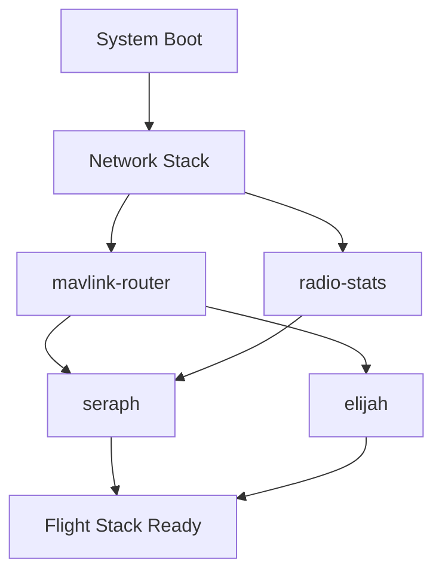

## 0) Required Equipment and Prerequisites

**Hardware Requirements**

* Air Microhard pMDDL2450/pDDL2450 radio with 4 antennas
  (inner MMCX→SMA lead **remains permanently attached**; outer SMA↔SMA connects to paddle).
* Jetson companion (USB Gadget enabled at `192.168.55.1`), FC connected/powered, PTH sensors, camera.
* Ground station: either a configured **ground Microhard** or an **adopted UniFi AP**.
* DHCP-enabled router/switch (bench network) with Ethernet patch cables.
* Linux/macOS workstation (for running `elijahctl`).
  *(Windows workstation supported only for optional ESC/KDEDirect validation.)*

**Software Requirements**

```bash
# Python and dependencies
python3 --version             # Requires 3.11+
pip install -e .              # Install from repository root (or pipx install elijahctl)
sudo apt-get -y install ansible  # Ubuntu/Debian or brew install ansible on macOS
```

**Required Environment Variables**

```bash
export AES_KEY="your-128-bit-aes-key"
export MICROHARD_PASS="supercool"  # Default password for newer firmware
export TAILSCALE_KEY="tskey-auth-..."
```

**Unit Naming Convention**

* `drone_id=012` → Jetson hostname: `el-012`, air radio hostname: `elijah-012-air`
* `sysid=12`

**Network Architecture**

```
┌─────────────────────────────────────────┐
│ Air Unit Network Topology               │
├─────────────────────────────────────────┤
│ Radio (Air/Slave):  192.168.168.1       │
│ ├── Jetson:         192.168.55.1        │
│ │   ├── mavlink-router: :14550          │
│ │   ├── radio-stats:    :22222          │
│ │   ├── seraph:         :8080           │
│ │   └── elijah:         :9090           │
│ └── Flight Controller: via Serial       │
└─────────────────────────────────────────┘

┌─────────────────────────────────────────┐
│ Ground Station Network Topology         │
├─────────────────────────────────────────┤
│ Radio (Ground/Master): 192.168.168.1    │
│ ├── GCS Computer:      DHCP Client      │
│ └── UniFi AP:          10.101.252.1/16  │
└─────────────────────────────────────────┘
```

---

## 1) Hardware Setup and Safety Verification

1. **Install antennas** on air radio with gentle torque; alternate RHCP/LHCP configuration.
   Ensure **inner MMCX→SMA** lead remains permanently attached.
2. **Connect power** to radio via harness → bench PDB (48 V).
3. **Connect Ethernet** from radio to bench switch/router (DHCP must be enabled).
4. **Configure Jetson**: Connect USB‑Gadget to workstation; Ethernet to bench switch; verify PTH sensors & camera connections; ensure FC is powered.

> **Critical Requirements**
>
> * **Never** use pinhole reset on Microhard radios. Use AT command two‑step procedure only.
> * Stage all configuration changes before applying (the tool enforces this automatically).

---

## 2) Air Radio Configuration

### 2.1 Service Discovery

```bash
elijahctl discover --ip 192.168.168.1 -v
```

**Expected Result**: SSH/HTTP/Telnet services should be displayed.
If services are not detected, power‑cycle **both radio and switch** simultaneously, then re‑run discovery.

### 2.2 Air Radio Provisioning

```bash
elijahctl provision \
  --role air \
  --drone-id 012 \
  --sysid 12 \
  --aes-key "$AES_KEY" \
  --microhard-pass "$MICROHARD_PASS" \
  --tailscale-key "$TAILSCALE_KEY" -v
```

**Configuration Applied:**

| Configuration Area         | Parameter                      | Applied Value                                                              |
| -------------------------- | ------------------------------ | -------------------------------------------------------------------------- |
| System → System            | Hostname, Description          | `elijah-012-air`, "Elijah 012 Air Radio"                                   |
| Wireless → Settings        | Freq/BW/Net/Mode/Power/Enc/Key | 2427 MHz / 5 MHz / `rainmaker` / **Slave** / 30 dBm / AES‑128 / `$AES_KEY` |
| Network → Interfaces       | LAN Configuration              | LAN protocol: `dhcp`                                                       |
| Applications → Radio Stats | Statistics Configuration       | Enabled, UDP port **22222**, fields: `RF,RSSI,SNR,Associated IP`           |

**Verification Methods:**

* **Web Interface Verification**: Access LuCI and verify all parameters match the table above.
* **Command Line Verification**:

  ```bash
  ssh admin@192.168.168.1  # Password: $MICROHARD_PASS
  uci show mh_radio; uci show network.lan; uci show mh_stats
  ```

  Confirm: `mode='Slave'`, `freq_mhz='2427'`, `bw_mhz='5'`, `net_id='rainmaker'`, `aes_key=...`, `network.lan.proto='dhcp'`, `mh_stats.@stats[0]...`.

**Post-Configuration Note**: After applying configuration and rebooting, the radio will acquire a new IP via DHCP (no longer `192.168.168.1`). The CLI automatically tracks the MAC address and locates the new IP.
To manually verify the new IP: check DHCP leases on your router or run `arp -an`.

---

## 3) Jetson Companion Configuration

### 3.1 Execute Ansible Deployment

If Jetson provisioning was skipped in step 2.2, run:

```bash
# Direct Ansible execution (normally handled by elijahctl)
ansible-playbook -i 'all,' deploy_companion.yml -T 60 \
  -e "ansible_host=192.168.55.1 ansible_user=jetson \
      device_name=el-012 sysid=12 \
      tailscale_auth_key=$TAILSCALE_KEY microhard_password=$MICROHARD_PASS"
```

**Verification:**

* Verify service status:

  ```bash
  ssh jetson@192.168.55.1   # Default password: 'jetson'
  systemctl is-active mavlink-router
  systemctl is-active seraph
  systemctl is-active elijah
  # Note: radio-stats may be inactive until radio connection is established
  ```

* Verify Tailscale connectivity:

  ```bash
  tailscale status --json | jq '.Self.DNSName, .Self.Online'
  ```

  Expected: DNS name beginning with `el-012` and `Online: true` once network path is established.

> If using ARK firmware hosting: upload firmware through UI at this stage, or skip if not applicable.

---

## 4) Flight Controller Configuration

**Configure SYSID:**

```bash
elijahctl set-sysid --host el-012 --sysid 12 -v
```

This executes `PARAM_SET MAV_SYS_ID=12`, initiates reboot, and verifies the parameter change.

**Verification:**

* Ground Control Station: Verify `MAV_SYS_ID`=12 and heartbeats at ~1 Hz.
* Command line verification available through mavlink-router logs or health monitoring (see next section).

---

## 5) System Health Verification

**Execute Health Check:**

```bash
elijahctl health --jetson el-012 --radio-ip auto --video udp:5600 -v
```

**Health Check Components:**

| Component           | Success Criteria                                       | Traditional Verification Method     |
| ------------------- | ------------------------------------------------------ | ------------------------------------ |
| Jetson Connectivity | Reachable with acceptable RTT                         | Manual ping/SSH test                |
| Radio Connectivity  | Reachable with acceptable RTT                         | Ping test or ARP/lease verification |
| **Tailscale**       | Online status with correct DNS name                   | Tailscale admin console              |
| **MAVLink**         | ~1 Hz heartbeats sustained over 5 seconds             | QGC heartbeat monitoring             |
| **Radio Stats**     | UDP port 22222 active with `rssi` & `snr` data        | Seraph radio stats display           |
| **Video**           | Non‑zero byte stream (UDP 5600 or RTSP)               | Seraph preview / camera interface    |
| **PTH**             | Pressure/Temperature/Humidity values present          | Seraph PTH widget                    |
| **Versions**        | Seraph/Elijah git hashes and FC firmware identified   | Seraph version display               |

**Visual Indicators:** Radio face should display **three solid green RSSI LEDs**, with **TX/RX LEDs blinking red** when linked to ground station.

**Documentation:** JSON report automatically saved to `~/.elijahctl/state/runs/…` for audit trail.

---

## 6) Ground Station Configuration

### Option A — Ground Microhard Configuration

```bash
elijahctl provision \
  --role ground \
  --drone-id 001 \
  --aes-key "$AES_KEY" \
  --microhard-pass "$MICROHARD_PASS" -v
```

**Verification:**

* Via LuCI or SSH: Confirm `mh_radio.@mh[0].mode='Master'`, matching RF parameters with air radio, LAN protocol = `dhcp`.
* Verify link establishment: Monitor air and ground statistics (RSSI/SNR) and LED indicators.

### Option B — UniFi AP Configuration

```bash
elijahctl unifi \
  --controller https://unifi.local \
  --user admin --pass '...' \
  --name rainmakerGCSX \
  --ip 10.101.252.1/16 \
  --disable-24ghz --disable-autolink -v
```

**Verification:**

* UniFi Controller: Verify **2.4 GHz disabled**, Auto‑Link/Auto‑Optimize disabled, device named `rainmakerGCSX`, static IP `10.101.252.1/16`.
* Tool validates WLAN configuration and alerts if any SSID includes 2.4 GHz.

---

## 7) System Resilience Validation

Perform these tests to ensure configuration stability:

1. **Idempotence Test** - Re‑run provisioning with identical parameters:

   ```bash
   elijahctl provision --role air --drone-id 012 --sysid 12 \
     --aes-key "$AES_KEY" --microhard-pass "$MICROHARD_PASS" --tailscale-key "$TAILSCALE_KEY" -v
   ```

   **Expected**: Configuration applies cleanly without disruption; health check remains passing.

2. **Power Cycle Recovery** - Power‑cycle radio and switch simultaneously, then:

   ```bash
   elijahctl health --jetson el-012 --radio-ip auto -v
   ```

   **Expected**: Tool locates radio via cached MAC address; all checks pass.

3. **HTTP Fallback Verification**: If SSH is unavailable, tool should utilize **ubus/HTTP** fallback and complete configuration.

4. **Factory Reset Procedure** (if recovery needed):

   ```bash
   elijahctl reset-radio --ip 192.168.168.1 --force
   ```

   **Verification**: Radio returns to factory defaults; re‑provisioning succeeds.

---

## 8) Production Checklist Documentation

**Hardware-in-the-Loop (HITL) Phase Documentation:**

```bash
cat > /tmp/hitl.json <<'JSON'
{
  "serial_qr": "ELJ-012-AAAA",
  "air_radio_fw_kept_factory": true,
  "air_radio_configured": true,
  "remoteid_configured": true,
  "remoteid_serial_20d": "12345678901234567890",
  "remoteid_faa_entered": true,
  "jetson_git_hash": "abc123deadbeef",
  "px4_fw_ref": "vX.Y.Z",
  "param_set_version": "v2_standard",
  "sysid_set": 12,
  "seraph_hitl_ok": true,
  "esc_fw_ref": "KDE-XX.Y",
  "esc_params_ref": "v2_standard.cfg",
  "motor_map_ok": true,
  "ads_power_ok": true,
  "arm_no_props_ok": true,
  "arm_safety_param_ok": true,
  "elrs_configured": false,
  "hitl_signed_by": "operator"
}
JSON

elijahctl checklist --update /tmp/hitl.json --drone-id 012 --phase hitl -v
```

**Verification:**

* CSV record appended to `~/.elijahctl/inventory/checklist.csv`
* Signed JSON documentation saved to `~/.elijahctl/state/runs/…`

*(Execute with `--phase insitu` after vehicle installation.)*

---

## 9) Acceptance Criteria

* **Radio Configuration**: LuCI/SSH confirms exact RF, DHCP, and statistics settings; single atomic commit verified.
* **Jetson Services**: All services active (radio‑stats may pend until connection), Tailscale online as `el-012`, FC SYSID = 12, heartbeats confirmed.
* **System Health**: Radio statistics (RSSI/SNR), PTH telemetry, video stream, and version information verified.
* **Ground Station**:

  * *Microhard*: Master mode confirmed, link established with air unit.
  * *UniFi*: 5 GHz exclusive operation, Auto‑Link/Optimize disabled, static IP configured.
* **Documentation**: CSV and JSON records contain all required fields.

---

## 10) Service Dependencies and Management

### Service Architecture


### Service Descriptions

| Service | Purpose | Dependencies | Port | Start Order |
|---------|---------|--------------|------|-------------|
| **mavlink-router** | Routes MAVLink messages between FC and GCS | Serial port, network | UDP 14550 | 1st |
| **radio-stats** | Collects and publishes radio telemetry | Radio network interface | UDP 22222 | 2nd |
| **seraph** | High-level vehicle control and monitoring | mavlink-router, radio-stats | HTTP 8080 | 3rd |
| **elijah** | Mission management and autonomy | mavlink-router, seraph | HTTP 9090 | 4th |

### Service Management Commands
```bash
# Check all services
ssh jetson@192.168.55.1
systemctl status mavlink-router seraph elijah radio-stats

# Correct startup order
sudo systemctl start mavlink-router && sleep 2
sudo systemctl start radio-stats && sleep 1
sudo systemctl start seraph && sleep 1
sudo systemctl start elijah

# View service logs
journalctl -u mavlink-router -f
```

---

## 11) UCI Profile Detection

The system automatically detects and maps Microhard firmware profiles to UCI configuration paths.

### How It Works
1. System runs `uci show` to gather configuration
2. Searches for known patterns (e.g., `mh_radio.*`)
3. Maps semantic keys to UCI paths
4. Falls back to custom profiles if defined

### Custom Profile Definition
Create `~/.elijahctl/state/mh_profile.json` for non-standard firmware:
```json
{
  "name": "custom_mh_v2",
  "uci_keys": {
    "hostname": ["system", "@system[0]", "hostname"],
    "role": ["mh_radio", "@mh[0]", "mode"],
    "freq_mhz": ["mh_radio", "@mh[0]", "freq_mhz"],
    "tx_power": ["mh_radio", "@mh[0]", "tx_power"],
    "aes_key": ["mh_radio", "@mh[0]", "aes_key"]
  }
}
```

---

## 12) Troubleshooting Guide

### Common Issues

#### No Services at 192.168.168.1
* Power‑cycle **both radio and switch simultaneously**
* Re‑run: `elijahctl discover --ip 192.168.168.1 -v`
* Check link: `ethtool eth0` (should show "Link detected: yes")

#### Radio Unreachable Post-Configuration
* Use MAC-based discovery: `elijahctl health --radio-ip auto`
* Check DHCP leases: `cat /var/lib/dhcp/dhcpd.leases`
* Manual scan: `sudo arp-scan --local | grep -i microhard`

#### Service Dependency Failures
```bash
# Check dependencies
systemctl list-dependencies mavlink-router

# Reset services
sudo systemctl daemon-reload
sudo systemctl reset-failed

# Manual start in order
for service in mavlink-router radio-stats seraph elijah; do
  sudo systemctl start $service
  sleep 2
  systemctl is-active $service || break
done
```

#### No MAVLink Heartbeats
* Check mavlink-router: `systemctl status mavlink-router`
* Test serial: `sudo screen /dev/ttyTHS0 57600`
* Re-run: `elijahctl set-sysid --host el-012 --sysid 12 -v`

#### UCI Configuration Not Applied
```bash
# Force commit
ssh admin@192.168.168.1
uci commit && sync && reboot

# Check filesystem
df -h  # Ensure not full
```

### Advanced Diagnostics
```bash
# Real-time radio stats
nc -u -l 22222 | jq '.'

# Service logs
ssh jetson@192.168.55.1 "journalctl -u mavlink-router -u seraph --since '1 hour ago'"

# MAVLink capture
sudo tcpdump -i any -w mavlink.pcap 'udp port 14550'
```

---

## 13) Firmware Compatibility

### Tested Versions
| Component | Version | Status |
|-----------|---------|--------|
| **Microhard pMDDL2450** | | |
| Firmware 1.0.7.1 | 2023-06-15 | ✅ Stable, recommended |
| Firmware 1.0.8.0 | 2023-09-20 | ⚠️ Beta, enhanced stats |
| Firmware 1.0.6.x | 2023-03-01 | ⚠️ Legacy, limited support |
| **Jetson** | | |
| JetPack 5.1.2 | L4T 35.4.1 | ✅ Recommended |
| JetPack 5.1.1 | L4T 35.3.1 | ✅ Supported |
| **PX4** | | |
| PX4 1.14.0 | 2023-07-01 | ✅ Recommended |
| PX4 1.13.3 | 2023-03-01 | ⚠️ Minimum |

### Known Issues
* Radio FW < 1.0.6: Missing UCI support
* JetPack 5.0.x: Network driver issues
* PX4 < 1.13.0: MAVLink v2 issues

---

## 14) Optional: ESC Configuration

For ESC validation:

1. Windows workstation: Launch **KDEDirect Device Manager**; flash ESC firmware; load `v2_standard.cfg`.
2. Verify motor mapping with **camera facing forward**:

   * Motor 1 (front‑right): **CW**
   * Motor 3 (front‑left): **CCW**
   * Motor 2 (rear‑left): **CW**
   * Motor 4 (rear‑right): **CCW**
3. Document `esc_fw_ref`, `esc_params_ref`, and `motor_map_ok` in HITL JSON.

---

## 15) Required Documentation per Unit

* `~/.elijahctl/state/runs/*.json` from health and checklist operations.
* `~/.elijahctl/inventory/checklist.csv` entry.
* (Optional) LuCI interface screenshots documenting System/Wireless/Network/Statistics configuration.
* Jetson `tailscale status --json` output; `systemctl is-active` results.
* UniFi configuration: Screenshot confirming 5 GHz exclusive SSID and static IP assignment.